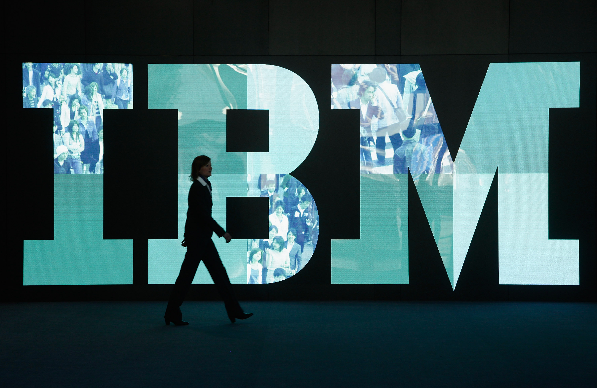

# RegTech: Transforming Regulatory Compliance 
*[A woman walks past the IBM logo at the CeBIT technology trade fair in Hanover, Germany](https://content.fortune.com/wp-content/uploads/2018/10/ibm-stock-price.jpg?resize=1500,1000)* 
## Overview and Origin

**International Business Machines**  commonly known as **IBM** is a software company that offers and produces hardware, software cloud-based services and cognitive computing1. Founded by Charles Ranlett Finn in 1911, IBM is one of the top information technology companies in the world. IBM was incorporated in New York State as the *Computing-Tabulating-Recording Company* then renamed in 1924. The primary focus of IBM is to offer companies various technical solutions to help increase effeciency. In fact, it is a leader in providing SaaS (software as a service) solutions to 47 out of 50 fortune 500 companies including Caterpillar, Lindt and Princess Cruises1.

Of the many innovations that IBM offers, Regulatory Technology or RegTech is transforming regulatory compliance for financial institutions. After the recession in 2008, managing risk and tracking compliance became the prime focus of many financial institutions in the United States1. As a result, IT companies such as IBM leverged their expertise in artificial intellegince to come up with innovative ways to help financial institutions meet their compliance requirements at a reduced cost and effort. 

Further, on May 1st, 2019 IBM partnered with Thomas Reuters, an established Canadian IT company, in which both firms were able to gain client trust in RegTech to grow its funding. Since 2017, funds for RegTech have doubled from $1.9bn to almost $5bn in the following years2. IBM continues to invest and fund new solutions by using part of the revenue it generates offering SaaS products and gaining customer intreset3.  

## Business Activities

Accordingly, IBM states that global banks have paid more than $320 billion in fines and penalties since 20085. These penalties were due to gaps in compliance and risk regulations. In the hope that they can survive the increasing demand on regulatory compliance, financial institutions figured the only way to do that is by hiring more compliance experts. This of course would result in the increase of overhead costs. However, IBM developed a way for banks to stay on top of their compliance requirements while also remaining cost-effecient. RegTech promises to cut tedious manual hours, eliminate human errors, and save financial institutions millions of USD in resources. For Example, this automation will help gather security analytics and KYC verifications. 

IBM offers RegTech to all businesses requiring regulatory compliance assistance. However, the primary client for RegTech is financial instutitons because of their high demand for risk mitigation after the recession. Currently, the financial markets of the United States are the largest in the world6. The most crucial advantage that IBM holds over other RegTech vendors, is extensive knowledge of financial markets and business clients. In fact, IBM is one of the oldest information technology companies in the United States and well-versed in automation solutions and AI. 

In light of IBM having the advantage of historical IT market knowledge, the technology behind RegTech is developed to fit each client's business needs. IBM employs cognitive computing tools such as machine learning and natural processing. According to their expertise, "cognitive systems can read as many as 800 million pages per second in natural language"5. This type of innovation can help expedite the manual effort spent on processing bulks of documents related to compliance. Not only that, but the way they are implementing this technology is by monitoring consumer trend and gathering data insights to help process structured and unstructured data likewise5. 

## Landscape
Not only does IBM dominate the information technology market but it is also huge contributer to the financial industry. Specifically, IBM is part of the enterprise financial software domain. Coupled with offering regulatory compliance technology solutions, it also offers blockchain applications and cloud computing innovations for clients in various financial fields.  

To say the least, the financial industry has seen a huge disruption throughout the years caused by new technology developed by IT firms such as IBM. Finance and accounting as we once knew them are no longer lingering in big banks. For instance, 5 or 10 years ago we were spending hours manually entering customer transactions on a simplified ledger system. Today with the introduction of cloud services, blockchain, and AI big firms such as Goldman Sachs, JPMorgan, and BNY Melon are investing millions of dollars on automating these processes. Similarily risk management and compliance is still a highly manual effort which could be improved with the growth of RegTech innovations in the upcoming years7. 

## Results

* What has been the business impact of this company so far?

* What are some of the core metrics that companies in this domain use to measure success? How is your company performing, based on these metrics?

* How is your company performing relative to competitors in the same domain?

## Recommendations

* If you were to advise the company, what products or services would you suggest they offer? (This could be something that a competitor offers, or use your imagination!)

* Why do you think that offering this product or service would benefit the company?

* What technologies would this additional product or service utilize?

* Why are these technologies appropriate for your solution?

## References 
---
1) [What is IBM?](https://www.cbronline.com/what-is/what-is-ibm-4950406/)
2) [Thomas Reuters & IBM Introduce Powerful New AI and Data Combination](https://www.thomsonreuters.com/en/press-releases/2019/may/ibm-thomson-reuters-introduce-powerful-new-ai-and-data-combination.html)
3) [IBM and Thomas Reuters have teamed up to launch an AI regtech solution](https://www.businessinsider.com/ibm-thomson-reuters-launch-ai-regtech-solution-2019-5#:~:text=Regtech%20funding%20has%20never%20been,in%202017%20to%20%244.5%20billion)
4) [How IBM Makes Money?](https://www.investopedia.com/how-ibm-makes-money-4798528)
5) [RegTech in the Cognitive Era](https://www.ibm.com/thought-leadership/institute-business-value/report/regulatory-technology)
6) [The Financial Services Industry in the United States](https://www.selectusa.gov/financial-services-industry-united-states#:~:text=Overview,of%20U.S.%20gross%20domestic%20product.)
7) [The Financial Times: Software Revolution](https://www.ft.com/content/f4e40f9c-580c-11dd-b02f-000077b07658)
